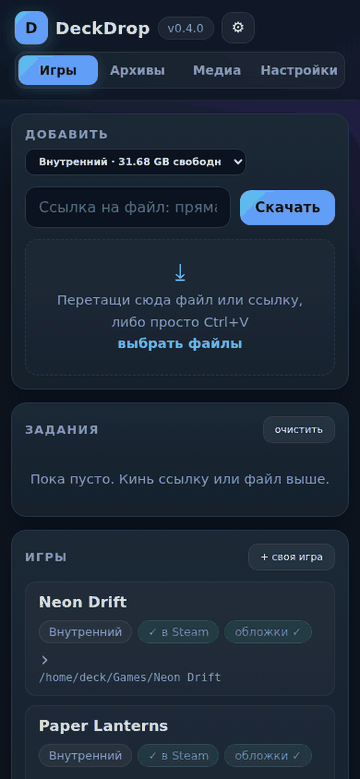
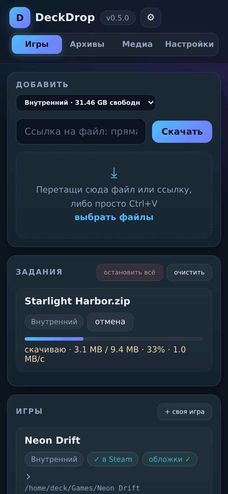
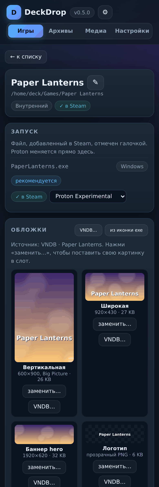
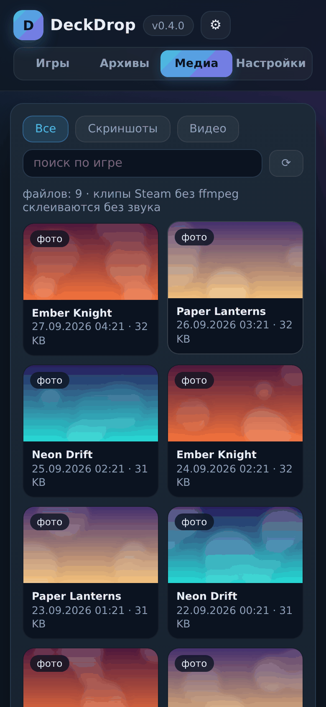
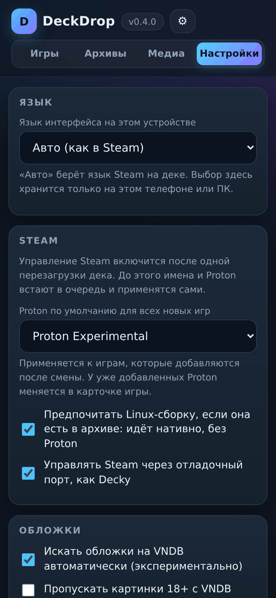
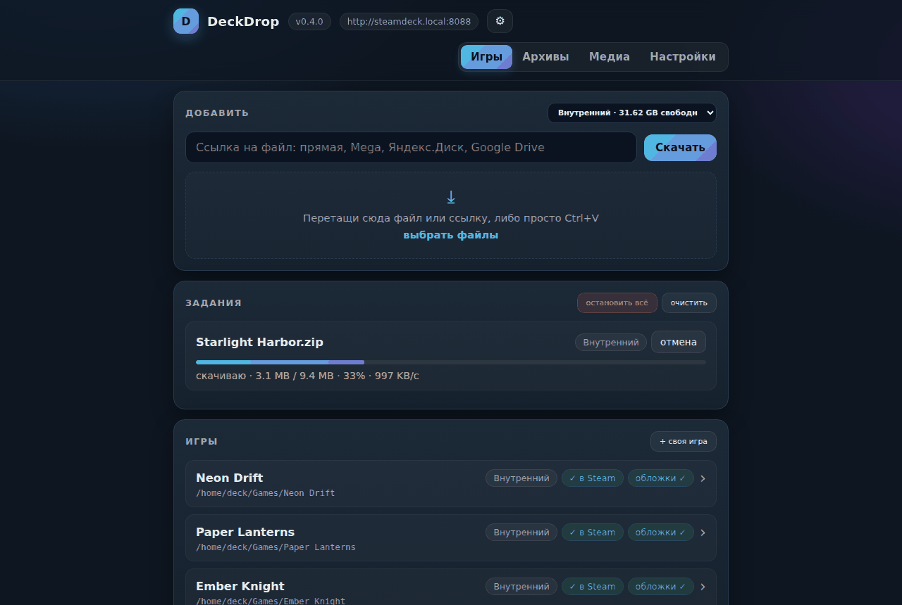

<div align="center">

# DeckDrop

**Помощник Steam и галерея для Steam Deck по локальной сети**

Открываешь страницу с телефона или ПК, вставляешь ссылку или кидаешь файл —
дек сам скачивает, распаковывает и добавляет игру в Steam с обложками.
А скриншоты и записи с дека так же просто забрать себе на телефон или ПК.

[](https://github.com/Aniforka/deckdrop/releases/latest)
[](https://github.com/Aniforka/deckdrop/actions/workflows/ci.yml)
[](LICENSE)


[English](README.en.md) · **Русский** · [Что нового](CHANGELOG.md)

</div>

## <a id="what-it-is" name="what-it-is"></a>Что это

<p align="center"></p>

DeckDrop — маленькая веб-страница, которая живёт на самом деке. Её открывают с любого
устройства в той же Wi-Fi-сети, и дальше с дивана можно:

- **скачать игру по ссылке** — прямой, Mega (расшифровывается прямо на деке), Яндекс.Диск,
  Google Drive — или просто перекинуть файл с телефона и ПК;
- **распаковать архив** — zip, 7z, rar, многотомные, с паролем (спросит и запомнит);
- **добавить в Steam** под нормальным именем, с Proton по умолчанию и **всеми пятью видами
  обложек**: с VNDB для визуальных новелл или нарисованными из иконки exe;
- **положить патч** прямо в папку игры, а архив с патчем — распаковать поверх, заранее
  увидев, что заменится;
- **забрать сейвы** в zip и вернуть их обратно;
- **смотреть скриншоты и записи** Steam в галерее под паролем и скачивать их на телефон;
- управлять всем этим **на русском или английском**: язык берётся из Steam на деке.

Один файл на Python, только стандартная библиотека. На стоковом SteamOS ничего
доустанавливать не нужно, root и режим разработчика не нужны, обновления системы его не ломают.

## <a id="screenshots" name="screenshots"></a>Как это выглядит

<table>
<tr>
<td align="center" valign="top" width="50%"><br><sub>Скачивание и список игр</sub></td>
<td align="center" valign="top" width="50%"><br><sub>Страница игры: Proton и обложки</sub></td>
</tr>
<tr>
<td align="center" valign="top" width="50%"><br><sub>Галерея скриншотов</sub></td>
<td align="center" valign="top" width="50%"><br><sub>Настройки и язык</sub></td>
</tr>
</table>

<p align="center"></p>

## <a id="quick-start" name="quick-start"></a>Быстрый старт

1. На деке переключись в **Desktop Mode** и открой **Konsole**.
2. Выполни две команды:

   ```bash
   wget https://github.com/Aniforka/deckdrop/releases/latest/download/install.sh
   sh install.sh
   ```

3. Открой на телефоне адрес, который напечатает установщик, например
   `http://steamdeck.local:8088`, и запиши **PIN администратора**.

Всё. DeckDrop запускается сам при каждом включении дека и работает и в Gaming Mode.

## <a id="contents" name="contents"></a>Оглавление

- [Установка](#installation)
  - [Что нужно](#requirements)
  - [С GitHub](#from-github)
  - [С ПК по локальной сети](#from-a-pc-on-your-network)
  - [Первый запуск: адрес и PIN](#first-run-address-and-pin)
  - [Обновление](#updating)
  - [Логи, перезапуск, удаление](#logs-restart-uninstall)
  - [Переменные окружения](#environment-variables)
- [Язык интерфейса](#interface-language)
- [Управление Steam](#steam-control)
- [Пароли и PIN](#passwords-and-pin)
- [Игры](#games)
  - [Скачивание и распаковка](#downloading-and-unpacking)
  - [Своя игра](#adding-a-game-you-already-have)
  - [Страница игры](#game-page)
  - [Файлы игры и патчи](#game-files-and-patches)
- [Обложки](#artwork)
- [Сейвы](#saves)
- [Архивы](#archives)
- [Медиа](#media)
- [Какие ссылки работают](#supported-links)
- [Mega](#mega)
- [Сеть и прокси](#network-and-proxy)
- [Настройки](#settings)
- [Безопасность](#security)
- [Частые проблемы](#troubleshooting)
- [Разработка](#development)

## <a id="installation" name="installation"></a>Установка

### <a id="requirements" name="requirements"></a>Что нужно

- Steam Deck на **SteamOS 3.x**. На обычном Linux со Steam тоже работает, если есть
  `python3` 3.8+ и `systemd --user`.
- Дек и телефон (или ПК) в **одной Wi-Fi-сети**.
- Интернет на деке — для установки с GitHub. Без него можно поставить с ПК, см. ниже.
- По желанию: `ffmpeg` (точная подгонка обложек, склейка записей Steam со звуком)
  и `7z` или `bsdtar` (архивы 7z и rar). Без них zip распаковывается встроенными средствами,
  а обложки ставятся как есть.

Root-пароль, `sudo`, выключение read-only и Decky Loader **не нужны**: DeckDrop живёт
в домашней папке и работает как пользовательский сервис.

### <a id="from-github" name="from-github"></a>С GitHub

1. Переключи дек в Desktop Mode: кнопка Steam → «Питание» → «Переключиться на рабочий стол».
2. Открой **Konsole** (меню приложений → «Система» → Konsole).
3. Скачай и запусти установщик:

   ```bash
   wget https://github.com/Aniforka/deckdrop/releases/latest/download/install.sh
   ```

   ```bash
   sh install.sh
   ```

   Установщик положит `deckdrop.py` в `~/deckdrop`, проверит, что файл скачался целиком,
   зарегистрирует пользовательский сервис `deckdrop` с автозапуском и сразу его запустит.
   В конце он напечатает **адрес страницы** и **PIN администратора**.

4. Можно возвращаться в Gaming Mode: сервис работает и там, и после перезагрузки.

<details>
<summary>То же самое вручную, без установщика</summary>

```bash
mkdir -p ~/deckdrop
wget -O ~/deckdrop/deckdrop.py https://github.com/Aniforka/deckdrop/releases/latest/download/deckdrop.py
python3 ~/deckdrop/deckdrop.py --install
```

Буква в ключе `-O` — заглавная латинская **O**, не ноль.
</details>

### <a id="from-a-pc-on-your-network" name="from-a-pc-on-your-network"></a>С ПК по локальной сети

Подходит, если у дека нет выхода на GitHub или хочется поставить свою копию.

1. На ПК скачай `deckdrop.py` и `install.sh` со страницы
   [последнего релиза](https://github.com/Aniforka/deckdrop/releases/latest), открой терминал
   в этой папке и запусти раздачу. Окно не закрывай:

   ```bash
   python -m http.server 8000
   ```

2. Узнай адрес ПК в локальной сети: на Windows — `ipconfig`, строка «IPv4-адрес»;
   на Linux и macOS — `ip addr` или `ifconfig`. Дальше в примерах `192.168.1.10`.
3. На деке в Konsole:

   ```bash
   wget 192.168.1.10:8000/install.sh
   sh install.sh http://192.168.1.10:8000/deckdrop.py
   ```

4. Когда установщик напишет адрес и PIN, раздачу на ПК можно закрыть через Ctrl+C.

Если на ПК включён брандмауэр, при первом запуске `python` он спросит, пускать ли
подключения из частной сети, — разреши.

### <a id="first-run-address-and-pin" name="first-run-address-and-pin"></a>Первый запуск: адрес и PIN

Страница открывается с любого устройства в той же сети:

- **`http://steamdeck.local:8088`**, где `steamdeck` — имя дека (видно в выводе установщика
  и в «Настройки» → «Система» → «Имя хоста» на деке). Адрес `.local` понимают iOS, macOS,
  Linux и Windows 10+; некоторые Android-браузеры его не находят.
- **`http://<IP дека>:8088`** — работает везде. IP напечатан установщиком и виден на вкладке
  «Настройки» самой страницы.

Сохрани адрес в закладки или добавь на домашний экран телефона — получится почти приложение.

**PIN администратора** защищает опасные действия: удаление, обновление, прокси. При первой
установке DeckDrop придумывает случайный PIN из 4 цифр. Поменять его можно в «Настройках».
Если PIN потерялся, посмотри его на деке:

```bash
grep admin_pin ~/.config/deckdrop/state.json
```

Порт 8088 выбран не случайно: 8080 занимает отладочный порт самого Steam, через который
DeckDrop им управляет (см. [Управление Steam](#steam-control)).

### <a id="updating" name="updating"></a>Обновление

Внизу страницы есть кнопка **«Обновить утилиту»**. Она берёт `deckdrop.py` из
[последнего релиза](https://github.com/Aniforka/deckdrop/releases/latest), проверяет его,
заменяет себя и перезапускается. Можно указать и свою ссылку, например раздачу с ПК
`http://192.168.1.10:8000/deckdrop.py`: адрес запоминается. Если в новой версии сменился
порт, страница сама переедет на новый адрес.

**Настройки, пароли, список игр и всё остальное при обновлении сохраняются.** Это проверяется
автоматически перед каждым релизом: тест ставит предыдущие версии, настраивает их через
интерфейс, обновляет кнопкой и сверяет, что ничего не потерялось.

Повторный запуск `sh install.sh` тоже обновляет до последней версии.

<details>
<summary>Стоит версия 0.3.23 или старше?</summary>

Они обновлялись из ветки `main`, где файла больше нет. Обнови такую копию один раз вручную:
вставь в окно «Обновить утилиту» ссылку
`https://github.com/Aniforka/deckdrop/releases/latest/download/deckdrop.py`
или запусти `sh install.sh`. Дальше адрес обновления сам переключится на релизы.
</details>

### <a id="logs-restart-uninstall" name="logs-restart-uninstall"></a>Логи, перезапуск, удаление

| Что | Команда на деке |
|---|---|
| Логи в реальном времени | `journalctl --user -u deckdrop -f` |
| Перезапустить | `systemctl --user restart deckdrop` |
| Остановить до перезагрузки | `systemctl --user stop deckdrop` |
| Удалить сервис | `python3 ~/deckdrop/deckdrop.py --uninstall` |
| Запустить без сервиса, в терминале | `python3 ~/deckdrop/deckdrop.py` |

`--uninstall` убирает только сервис. Скачанные игры, `~/deckdrop`, настройки
(`~/.config/deckdrop`) и кеш (`~/.cache/deckdrop`) остаются — их можно удалить руками.
Маркер управления Steam удаляется, если до удаления выключить эту функцию в настройках.

### <a id="environment-variables" name="environment-variables"></a>Переменные окружения

Задаются в `~/.config/systemd/user/deckdrop.service`, в секции `[Service]`, строками вида
`Environment=DECKDROP_PORT=8090`. После правки: `systemctl --user daemon-reload`,
затем `systemctl --user restart deckdrop`.

| Переменная | По умолчанию | Что делает |
|---|---|---|
| `DECKDROP_PORT` | `8088` | порт страницы |
| `DECKDROP_GAMES` | `~/Games` | папка игр на внутреннем диске |
| `DECKDROP_DISKS` | — | дополнительные диски: `метка=/путь;метка2=/путь2` |
| `DECKDROP_STEAM` | ищется сам | корень Steam, если он не в стандартном месте |
| `DECKDROP_STATE` | `~/.config/deckdrop/state.json` | файл настроек и состояния |
| `DECKDROP_CEF` | `1` | `0` — не включать управление Steam |
| `DECKDROP_CEF_PORT` | `8080` | отладочный порт Steam |
| `DECKDROP_PIN` | случайный | начальный PIN при первой установке |
| `DECKDROP_UPDATE_URL` | последний релиз | адрес обновления по умолчанию |
| `DECKDROP_EXTRACT` | `1` | `0` — не распаковывать архивы |
| `DECKDROP_KEEP` | `1` | `0` — удалять архив после успешной распаковки |

## <a id="interface-language" name="interface-language"></a>Язык интерфейса

DeckDrop говорит **по-русски и по-английски**. Главный источник языка — **клиент Steam на деке**:
какой язык выбран в настройках дека, на таком DeckDrop и отвечает, с какого бы устройства ни
открыли страницу. Системная локаль SteamOS всегда английская, поэтому DeckDrop смотрит именно
на язык Steam.

1. **Выбор в «Настройках» → «Язык»** на этом телефоне или ПК, если он сделан. Он хранится только
   на этом устройстве: у тебя может быть русский, а у друга на его телефоне — английский.
2. **Язык Steam на деке** («Авто», по умолчанию).
3. Английский, если в Steam выбран язык, перевода на который пока нет.

На выбранном языке приходят и сообщения об ошибках, и тексты заданий. Сообщения установщика
следуют языку Steam на деке. Логи в `journalctl` всегда на английском.

## <a id="steam-control" name="steam-control"></a>Управление Steam

Steam держит настройки в памяти и переписывает файлы при выходе, поэтому правки `config.vdf`
и `shortcuts.vdf` при запущенном клиенте пропадают. DeckDrop идёт тем же путём, что Decky
Loader: включает у Steam локальный отладочный порт CEF (файл-маркер
`.cef-enable-remote-debugging` в папке Steam) и через него просит клиент добавить ярлык
с нужным именем, выбрать Proton, поставить обложки, убрать ярлык.

- Порт открывается только на самом деке (localhost), снаружи он недоступен.
- Включается после **одной перезагрузки дека**. Состояние видно внизу страницы и в настройках.
- Пока управления нет, игры добавляются через `steamos-add-to-steam`, а имя и Proton встают
  в очередь и применяются сами, как только управление появится.
- Выключается в настройках: маркер удаляется, и Steam при следующем запуске закроет порт.

## <a id="passwords-and-pin" name="passwords-and-pin"></a>Пароли и PIN

- **PIN администратора** — удаление игр и медиа, сброс пароля галереи, прокси, обновление.
  Случайный при установке, от 4 до 8 цифр, меняется в «Настройках».
- **Пароль галереи** задаётся при первом заходе на вкладку «Медиа» и спрашивается при каждом
  её открытии. Хранится хешем PBKDF2, сессия живёт 12 часов. Сбрасывается по PIN внизу страницы.

## <a id="games" name="games"></a>Игры

### <a id="downloading-and-unpacking" name="downloading-and-unpacking"></a>Скачивание и распаковка

- Ссылку можно вставить в поле, нажать Ctrl+V прямо на странице или перетащить файл или ссылку.
  Рядом с заголовком — выбор диска (внутренний или microSD) с остатком места; выбор запоминается.
- Архивы (zip, 7z, rar, tar.\*) распаковываются в `<диск>/Games/<имя архива>`; хвост `(1)`
  от повторного скачивания на ПК из имени папки убирается.
- Зашифрованный архив останавливается со статусом «нужен пароль», поле для пароля — прямо
  в задании. Галочка «запомнить» добавляет пароль в список, который дальше пробуется сам.
- У каждого скачивания есть «отмена», «остановить всё» снимает всю очередь, недокачанное
  удаляется. «Очистить» убирает из списка завершённые задания.
- Каждая игра в списке — карточка: имя, диск, добавлена ли в Steam, есть ли обложки. Нажатие
  открывает [страницу игры](#game-page); «← к списку» или системная «назад» на телефоне
  возвращает обратно.

### <a id="adding-a-game-you-already-have" name="adding-a-game-you-already-have"></a>Своя игра

Кнопка **«+ своя игра»** добавляет в список **одну игру**, которая уже лежит где-то на деке,
например поставленную раньше вручную. Достаточно указать путь к файлу запуска:

    /home/deck/Games/MyGame/Game.exe

DeckDrop ничего не копирует и не перемещает: папка остаётся на месте и появляется в списке
с пометкой «своя». Дальше она ведёт себя как любая другая игра.

- Если игра уже есть в ярлыках Steam, DeckDrop подхватит её имя, Proton и обложки. Сам Steam
  и файлы игры при этом не меняются.
- В окне импорта отдельным списком показаны игры, которые **уже есть в Steam**, но лежат вне
  папок DeckDrop, — их можно добавить одним нажатием.
- Можно указать и саму папку игры; если exe лежит в `bin` или `game`, берётся папка выше.
- Добавлять можно из домашней папки и с подключённых носителей.
- «Убрать из DeckDrop» только убирает карточку. «Удалить с дека 🔒» удаляет файлы по PIN.

### <a id="game-page" name="game-page"></a>Страница игры

- **Запуск** — все исполняемые файлы игры. Рекомендуется Linux-сборка (`.sh`, `.x86_64`),
  если она есть: идёт нативно, без Proton. У добавленного файла — галочка и выбор Proton.
- **В Steam** — имя берётся из exe без расширения, с большой буквы (`yosuga.exe` → «Yosuga»),
  для безликих `game.exe` и `start.exe` — из имени папки; версии `v1.4`, теги в скобках
  и `(1)` отбрасываются. Если вариантов несколько, откроется окно с готовыми вариантами,
  полем для своего имени и выбором Proton. Потом имя меняется карандашом у заголовка.
- **Обложки** — все пять слотов Steam с предпросмотром, см. [Обложки](#artwork).
- **Сейвы** — что войдёт в бэкап, «скачать бэкап» и «импортировать zip».
- **Действия** — скрыть из списка, удалить с дека по PIN (галочка убирает и ярлык из Steam).
- **Сведения** — папка, размер, имя в Steam, AppID, Proton, источник обложек.

### <a id="game-files-and-patches" name="game-files-and-patches"></a>Файлы игры и патчи

В карточке «Файлы игры» можно загрузить патч или любой другой файл прямо в папку игры.
Путь пишется **относительно папки с exe**:

| Путь | Куда ляжет |
|---|---|
| пусто | рядом с exe |
| `data/patch` | в подпапку рядом с exe, её создаст, если нет |
| `../` | на уровень выше exe, например если он лежит в `bin/` |

Выйти за пределы папки игры нельзя. Если файл уже есть, DeckDrop спросит, а самый первый
вариант сохранит рядом как `имя.bak`, так что оригинал не потеряется даже после нескольких
обновлений патча.

**Распаковать архив поверх игры.** Кнопка «распаковать архив…» сначала распакует архив
на деке в сторонку и покажет, что в нём, куда ляжет, сколько файлов добавит и сколько заменит.
Если всё содержимое завёрнуто в одну папку (`Patch v2/…`), её можно снять галочкой. Заменяемые
файлы по умолчанию сохраняются как `.bak`. Если не подтвердить распаковку, ничего не изменится.

## <a id="artwork" name="artwork"></a>Обложки

Слоты Steam: вертикальная капсула 600×900 (её видно в Big Picture), широкая 920×430,
hero-баннер 1920×620, логотип и иконка. Полный набор ставится сразу после добавления игры.

- **VNDB** (экспериментально) — по имени игры ищется визуальная новелла. Обложка идёт
  в вертикальный слот, скриншот — в широкий и hero, логотип рисуется текстом, иконка берётся
  из exe. Автопоиск включается в настройках и срабатывает только при уверенном совпадении.
  Картинки 18+ можно пропускать галочкой в настройках.
- **Из иконки exe** — свой разбор PE-ресурсов, иконка на подложке её же цвета.
- **Свои картинки** — любой слот можно заменить файлом с телефона или ПК (PNG или JPEG)
  или конкретной картинкой с VNDB.
- С `ffmpeg` картинки точно кадрируются под слоты. Без него VNDB-картинки ставятся как есть.
- Если управление Steam активно, новые обложки видны сразу, иначе — после перезапуска Steam.

## <a id="saves" name="saves"></a>Сейвы

«Скачать бэкап» собирает в zip папки сохранений внутри игры (`save`, `saves`, `savedata`
и похожие), пользовательские папки из префикса Proton (`AppData`, `Documents`, `Saved Games`
без системного мусора) и для Linux-сборок — каталоги Ren'Py и Unity в домашней папке.
Перед импортом DeckDrop сам делает копию текущих сохранений в `~/.cache/deckdrop`, а файлы
из архива не могут выйти за пределы целевых папок.

## <a id="archives" name="archives"></a>Архивы

Всё, что лежит в `_inbox` на всех дисках: размер, дата, распакован ли. Нераспакованный можно
распаковать отсюда, любой — удалить. «Удалить распакованные» одним нажатием чистит те, для
которых уже есть папка игры. «Очистить всё» удаляет из `_inbox` вообще всё, но сначала
покажет, сколько места освободится; папки игр и текущие загрузки не трогаются.

## <a id="media" name="media"></a>Медиа

Скриншоты Steam с названиями игр, записи Steam (склеиваются в mp4, со звуком при наличии
`ffmpeg`), видео и картинки из `~/Videos` и `~/Pictures`. Тап по плитке открывает просмотр:
«скачать» сохраняет на телефон, «удалить с дека 🔒» освобождает место. Видео нормально
играет и перематывается и на iPhone.

## <a id="supported-links" name="supported-links"></a>Какие ссылки работают

| Источник | Что происходит |
|---|---|
| Прямая ссылка на файл | скачивается как есть |
| Яндекс.Диск (`disk.yandex.*`, `yadi.sk`) | прямая ссылка берётся через публичный API Диска |
| Google Drive | через `drive.usercontent.google.com` |
| Mega (`mega.nz`, `mega.co.nz`) | файлы и папки, новые и старые ссылки; расшифровка на деке |
| Telegram | ссылки на файл нет: скачай на телефоне и загрузи файлом |
| Страница с кнопкой (itch.io, обменники с таймером) | вместо файла приходит HTML, DeckDrop так и скажет |

## Mega

Mega шифрует файл прямо в браузере того, кто его выкладывал, а ключ хранится в самой ссылке
после решётки `#`. Поэтому **копировать надо ссылку целиком**: без хвоста после `#`
расшифровать нечем, и DeckDrop сразу об этом скажет.

| Ссылка | Что будет |
|---|---|
| `mega.nz/file/<код>#<ключ>` | скачается сразу, имя файла берётся из зашифрованных данных |
| `mega.nz/folder/<код>#<ключ>` | откроется список файлов; отмеченное скачается одной игрой |
| `mega.nz/folder/<код>#<ключ>/file/<код>` | скачается только этот файл |
| Старые `mega.nz/#!<код>!<ключ>` и `#F!<код>!<ключ>` | тоже понимаются |
| `mega.nz/#P!…` (под паролем) | пока не умеет: открой в браузере и возьми обычную ссылку |

Файл расшифровывается на лету (AES через системную libcrypto), а в конце сверяется
контрольная сумма Mega: побитый файл DeckDrop не выдаст за целый. Оборванная закачка
продолжается с того же места. Файлы качаются по одному — Mega не любит несколько соединений
с одного адреса.

**Папка с Mega — это одна игра.** Отмеченные файлы собираются одним заданием с общим
прогрессом («Игра · файл 12 из 300») и сохраняют всю структуру папок. Если в папке только
архивы, распаковывается главный: обычный архив, `.part1.rar` или `.7z.001`.

Если Mega пишет про лимит трафика — это её ограничение на бесплатные скачивания: поможет
подождать несколько часов или включить прокси.

## <a id="network-and-proxy" name="network-and-proxy"></a>Сеть и прокси

Провайдер может рвать соединение с VNDB — тогда в сведениях игры видно
`соединение сброшено`. На этот случай в настройках есть прокси, которым пользуется **только
сам DeckDrop**; остальной дек ходит в интернет как обычно.

- Поддерживаются `socks5://хост:порт` и `http://хост:порт`, можно с логином:
  `socks5://логин:пароль@хост:порт`.
- VLESS и подобные протоколы напрямую не поддерживаются, но и не нужны: их клиент (например,
  Xray) сам даёт локальный вход SOCKS5. Укажи адрес ПК с таким клиентом
  (`socks5://192.168.1.10:10808`, в клиенте разреши подключения из локальной сети) или поставь
  клиент на сам дек и укажи `socks5://127.0.0.1:10808`.
- Галочка «через прокси качать и сами игры» распространяет прокси на загрузки. По умолчанию
  выключена: большие файлы обычно быстрее качать напрямую.
- «Проверить связь с VNDB» покажет, доступен ли VNDB напрямую и через прокси, со временем ответа.
- Адрес прокси может содержать пароль, поэтому он **закрыт PIN**: на странице виден только
  замаскированный вид.

## <a id="settings" name="settings"></a>Настройки

Открываются вкладкой или шестерёнкой ⚙ в шапке; каждый переключатель сохраняется сразу.
Там: язык интерфейса, Proton по умолчанию для новых игр, предпочтение Linux-сборок,
управление Steam, автопоиск VNDB и пропуск 18+, прокси и проверка связи, проверка контрольной
суммы Mega, пароли архивов, адрес обновления, смена PIN и сведения о дисках и адресах.

## <a id="security" name="security"></a>Безопасность

DeckDrop рассчитан на **домашнюю сеть**. Галерея и опасные действия закрыты паролем и PIN,
но загрузка файлов и ссылок открыта: любой в твоей Wi-Fi-сети может положить файл на дек.
Шифрования (HTTPS) нет, так что пароли идут по сети открытым текстом. Не открывай порт 8088
в интернет и не запускай DeckDrop в общественных сетях.

## <a id="troubleshooting" name="troubleshooting"></a>Частые проблемы

<details>
<summary><b>Страница не открывается по адресу <code>steamdeck.local</code></b></summary>

Некоторые Android-браузеры не понимают адреса `.local`. Открой по IP: он напечатан
установщиком и виден в «Настройках» → «О системе», например `http://192.168.1.42:8088`.
Проверь, что телефон и дек в одной Wi-Fi-сети (не гостевой).
</details>

<details>
<summary><b>Имя или Proton не применились, «в очереди»</b></summary>

Управление Steam включается после одной перезагрузки дека. До этого изменения ждут в очереди
и применятся сами. Если управление выключено в настройках, имя и Proton придётся поставить
в Steam вручную.
</details>

<details>
<summary><b>«По ссылке отдаётся HTML-страница, а не файл»</b></summary>

Ссылка ведёт на страницу с кнопкой «Скачать» (itch.io, обменники с таймером), а не на сам
файл. Скачай на телефоне или ПК и перетащи файл на страницу DeckDrop.
</details>

<details>
<summary><b>Mega: «исчерпан лимит трафика»</b></summary>

Это ограничение Mega на бесплатные скачивания с одного адреса. Подожди несколько часов или
включи в настройках прокси с галочкой «через прокси качать и сами игры».
</details>

<details>
<summary><b>Обложки с VNDB не находятся, «соединение сброшено»</b></summary>

Провайдер блокирует VNDB. Включи прокси (см. [Сеть и прокси](#network-and-proxy)) и нажми
«Проверить связь с VNDB». Обложки из иконки exe работают и без сети.
</details>

<details>
<summary><b>Забыл PIN</b></summary>

На деке в Konsole: `grep admin_pin ~/.config/deckdrop/state.json`.
</details>

<details>
<summary><b>Хочу интерфейс на другом языке</b></summary>

Выбери его в «Настройках» → «Язык». Выбор действует только на этом устройстве.
Нового языка нет? Его легко добавить, см. [Разработка](#development).
</details>

## <a id="development" name="development"></a>Разработка

Исходники — пакет [`src/deckdrop`](src/deckdrop), по модулю на область; страница —
[`web/index.html`](src/deckdrop/web/index.html), `app.css` и `app.js`. Пользователю
достаётся один файл: [`tools/build.py`](tools/build.py) собирает пакет в `dist/deckdrop.py`,
и именно его выкладывают релизы. Внешних зависимостей нет ни у приложения, ни у сборки.

<details>
<summary>Структура</summary>

```
src/deckdrop/
  app.py             точка входа: сервер и фоновые циклы
  config.py          переменные окружения, пути, константы, log()
  state.py           state.json, PIN, пароль галереи
  i18n/              языки: __init__.py и по JSON на язык (en.json, ru.json)
  storage.py         диски, microSD, корни игр
  jobs.py            задачи загрузки и распаковки
  paths.py           имена файлов, тома архивов, размеры
  net.py             прокси (SOCKS5/HTTP), HTTP, повторы
  downloads.py       загрузка по ссылке, очередь, отмена
  aes.py, mega.py    Mega: AES (libcrypto или чистый Python), API, папки
  archives.py        распаковка, пароли, вкладка «Архивы»
  detect.py          exe в папке игры и человеческое имя игры
  steam/             VDF-файлы Steam, Proton, управление клиентом через CEF, ярлыки
  art/               PNG/ICO/PE-иконки, ffmpeg, обложки из иконки и VNDB
  games.py           вкладка «Игры», импорт, добавление в Steam
  saves.py, media.py, patches.py
  update.py          самообновление и перезапуск
  service.py         установка сервиса systemd
  bundle.py          откуда запущена копия: собранный файл или src/
  web/               server.py (HTTP API), page.py, index.html, app.css, app.js
tools/
  build.py           сборка в один файл
  dev.py             запуск прямо из src/, без сборки
  changelog.py       раздел CHANGELOG.md для описания релиза и его проверка
  screenshots.py     скриншоты и GIF для README на демо-данных
tests/
```
</details>

**Запуск на ПК без сборки:** `python tools/dev.py`. На Windows и без Steam часть функций
покажет «недоступно», а страница откроется на `http://localhost:8088`. Чтобы не трогать
свои папки, укажи отдельные `DECKDROP_STATE` и `DECKDROP_GAMES`.

**Проверки, те же, что в CI:**

```bash
python tools/build.py                     # -> dist/deckdrop.py
python -m pyflakes src tools tests
python -m unittest discover -s tests      # модули, языки, AES, VDF, обновление, сохранность данных
python tests/smoke.py dist/deckdrop.py    # сервер из собранного файла
python tests/ui_check.py                  # страница в Chromium на каждом языке (нужен playwright)
```

Главный тест — [`tests/test_user_data.py`](tests/test_user_data.py): он ставит предыдущие
релизы, настраивает их через интерфейс, обновляет кнопкой и проверяет, что ни одна настройка,
пароль, игра или файл пользователя не потерялись. В CI это отдельный обязательный шаг.

**Выпуск версии.**
1. Подними `__version__` в [`src/deckdrop/__init__.py`](src/deckdrop/__init__.py).
2. Опиши, что изменилось, в [`CHANGELOG.md`](CHANGELOG.md): новый раздел `## X.Y.Z — дата`
   в самом верху, с частями `### English` и `### Русский`. Без него CI красный, и релиз не выйдет
   (`python tools/changelog.py --check` проверит локально).
3. Влей в `main`. GitHub Actions соберёт файл, прогонит все проверки, создаст тег `vX.Y.Z`
   и релиз с `deckdrop.py` и `install.sh`. Описание релиза — раздел этой версии из
   `CHANGELOG.md`, а под ним GitHub добавит список пулл-реквестов и ссылку на сравнение
   с прошлой версией.

Коммиты без смены версии релиз не создают.

**Новый язык.** Скопируй [`src/deckdrop/i18n/en.json`](src/deckdrop/i18n/en.json) в
`<код>.json` (например `de.json`) и переведи значения, не трогая ключи и `{подстановки}`.
Больше ничего не нужно: язык появится в «Настройках» и будет выбираться по браузеру.
Тесты проверят, что ключи и подстановки совпадают со всеми остальными языками. Если у языка
своя система множественных форм, добавь её в `plural_form()` в
[`i18n/__init__.py`](src/deckdrop/i18n/__init__.py) и в `plural()` в `app.js`.
Скриншоты для README обновляются командой `python tools/screenshots.py`.
